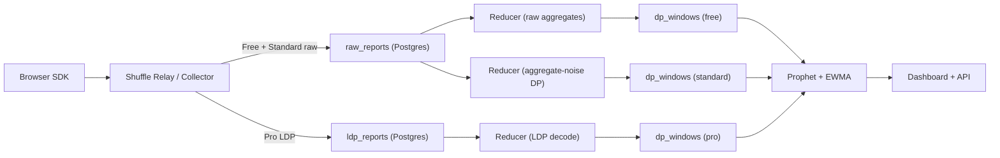

# Architecture

Valid supports three privacy tiers using plan-aware branching at ingestion, reduction, and serving:

- **Free**: Client sends raw events without LDP. Reducer writes raw aggregates directly.
- **Standard DP**: Client sends raw events; reducer adds aggregate noise and tracks epsilon spend.
- **Pro**: Client applies local DP; reducer decodes randomized response and aggregates LDP output.

Current vs planned

- **Current**: Single ingest path writes LDP reports and aggregates from randomized response.
- **Planned**: Plan-aware branching (Free raw, Standard aggregate-noise DP, Pro LDP), raw_reports table, and plan-based serving.

Ingest

The SDK captures pageviews, sessions, conversions, and histogram buckets. The collector validates short-lived upload tokens, then stores batches in either raw_reports or ldp_reports based on the site plan.

Event fields and dimensions

The SDK emits a compact event envelope. Identifiers are reduced to coarse buckets before transport so breakdowns are possible without retaining linkable data.

Fields captured (current + planned):

- **Current**
  - pageview: url (as provided by integrator), metadata, randomized response fields
  - session: referrer_bucket, engagement_bucket, randomized response fields
  - conversion: conversion_type (SDK label), randomized response fields
  - uniques: randomized response presence report
- **Planned**
  - pageview: path (normalized, no query string), referrer_category (direct, organic, referral, social, email, paid), device_type (mobile, desktop, tablet), country_code (2-letter), timestamp (minute bucket)
  - session: session_start, session_end (used to compute duration buckets), pageview_count
  - conversion: conversion_type (SDK label), value (purchase revenue)

Note: Until path normalization ships, integrators should pass a path without query parameters to avoid storing full URLs.

Privacy handling:

- IP is used only at the edge to derive country_code, then discarded.
- Raw referrer URLs and UTM parameters are never stored; only a high-level referrer_category is sent.
- No cookies or persistent identifiers; session_id is ephemeral and rotates daily.
- Timestamps are truncated to the minute for windowing.

Current implementation status:

- Stored event kinds: pageviews, sessions, uniques, conversions (see PrivatizedEvent in server/app/schemas.py).
- Conversion types are already supported in the reducer: payload.conversion_type yields metric "conversion:<type>".
- Dimension breakdowns (source, path, device, country) are planned; the dashboard currently uses seeded distributions.

Plan-aware nuance:

- Free + Standard: raw events are accepted and can be aggregated by dimension.
- Pro: dimension breakdowns require LDP encoding per dimension; until LDP support is extended, Pro can return only aggregate totals for those cuts.

Watermarks

Live windows tolerate LIVE_WATERMARK_SECONDS = 120 seconds of delay.
Payloads older than MAX_OUT_OF_ORDER_SECONDS = 300 seconds are dropped and counted in events_dropped_late_total.

Publishing guards

- Min sample: do not publish unless reports ≥ MIN_REPORTS_PER_WINDOW
- SNR: do not publish unless estimate / std_error > 1.5
- Include CI 80% and 95% with each published metric

Forecasting & anomalies

- Train Prophet when ≥ 60 days of history; otherwise HTTP 204
- Store and version models; promote only if MAPE improves ≥ 5%
- Anomalies: flag when outside Prophet bounds or by z-score on EWMA baseline; expose has_anomaly, z_score
- Forecast horizon is configurable for all tiers.
  - **Current**: 14-day horizon written by the Prophet job.
  - **Planned**: 30/60/90/365-day horizons. With sufficient data, MAPE should remain stable even as horizon increases, but it will vary by site and seasonality.

Plan-aware serving

Metrics, aggregates, and forecasts are filtered by plan. Free sites see raw aggregates, Standard sites see DP-noised aggregates and a privacy budget meter, and Pro sites see LDP-derived aggregates with per-event epsilon tracking.

Roadmap

- Import pipeline for customers migrating historical analytics into Valid (CSV/API ingest + backfill reducer).
